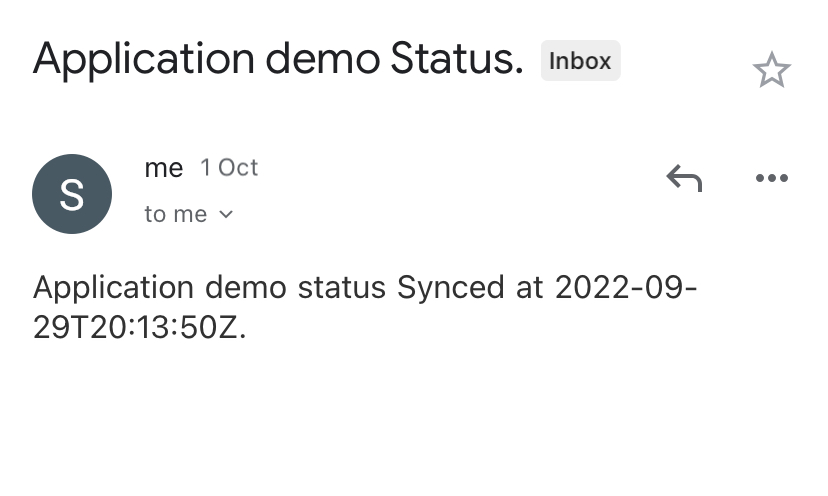
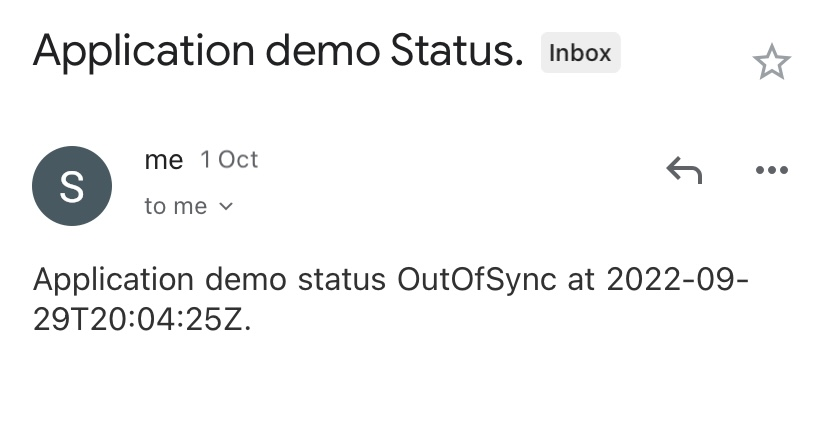

# ArgoCD-Notifications

Argo CD Notifications continuously monitors Argo CD applications and provides a flexible way to notify users about important changes in the application state. 

## Triggers:
The trigger defines the condition when the notification should be sent. The definition includes name `trigger.*`, condition `when` and notification templates reference `send`.

## Templates
The notification template is used to generate the notification content. 

triggers and templates are configured in argocd-notifications-cm ConfigMap.

## Example:
The below example is used to send an email notification when the applications status is *Synced* or *OutOfSync*
```
apiVersion: v1
kind: ConfigMap
metadata:
  name: argocd-notifications-cm
data:
  # Email notification service Registering
  service.email.gmail: |
    username: xxxxx@gmail.com
    password: ##app-password##
    host: smtp.gmail.com
    port: 465
    from: xxxxx@gmail.com
  # Templates
  template.app-sync-status: |
    email:
      subject: Application {{.app.metadata.name}} Status.
    message: |
      Application {{.app.metadata.name}} status {{.app.status.sync.status}} at {{.app.status.operationState.finishedAt}}.
  # Triggers
  trigger.sync-status: |
    - description: Application status is OutOfSync
      send:
      - app-sync-status
      when: app.status.sync.status == 'OutOfSync'
    - description: Application status is Synced
      send:
      - app-sync-status
      when: app.status.sync.status == 'Synced'
```
Next Step, to subscribe to notifications by annotating the Argo CD application or project
`notifications.argoproj.io/subscribe.<trigger.name>.gmail":"xxxx@gmail.com`

### Images: 
 
 

## Operational commands: 
- To troubleshoot:   
`kubectl logs -f -n argocd <po>`
- To subscribe to the notifications:   
`kubectl patch app <app-name> -n argocd -p '{"metadata": {"annotations": {"notifications.argoproj.io/subscribe.<trigger.name>.gmail":"xxxx@gmail.com"}}}' --type merge`

# References:
- https://argocd-notifications.readthedocs.io/en/stable/
- https://argocd-notifications.readthedocs.io/en/stable/triggers/
- https://argocd-notifications.readthedocs.io/en/stable/templates/
